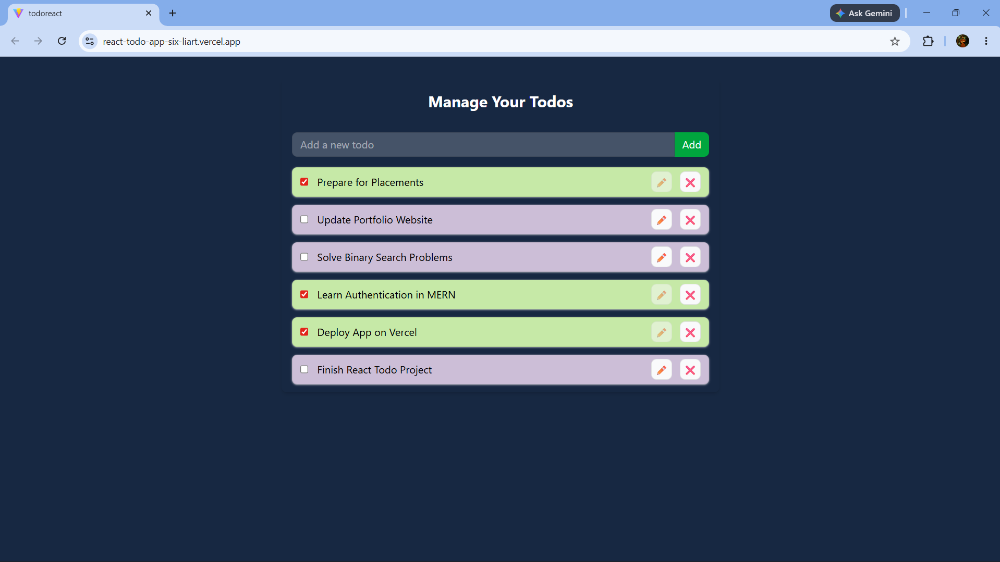

# ✅ React Todo App

> A modern Todo application built using React and Vite that helps users manage daily tasks efficiently with persistent local storage support.

React Todo App is a frontend web application that allows users to create, update, complete, and delete todos in a clean and responsive interface. The application uses React Context API for state management and LocalStorage for data persistence.

## 🚀 Live Demo

🌐 Live Website: https://react-todo-app-six-liart.vercel.app

## 🔗 GitHub Repository

💻 GitHub: https://github.com/ayushraj78088/react-todo-app

## 📸 Screenshots

### Todo Application Interface



## ✨ Features

- ➕ Add new todos
- ✏️ Edit existing todos
- ✅ Mark todos as completed
- ❌ Delete todos
- 💾 Persistent storage using LocalStorage
- ⚡ Fast and responsive UI
- 🎨 Clean UI built with TailwindCSS
- 🧠 State management using Context API

## 🛠️ Tech Stack

### Frontend

- React
- Vite
- JavaScript
- TailwindCSS

### State Management

- React Context API

### Storage

- LocalStorage

## 📂 Project Structure

```bash
src/
│
├── components/
│   ├── TodoForm.jsx
│   └── TodoItem.jsx
│
├── contexts/
│   ├── TodoContext.jsx
│   └── index.js
│
├── App.jsx
└── main.jsx
```

## 💻 Running the Project Locally

To run this project on your local machine, follow these steps:

### 1. Clone the Repository

```bash
git clone https://github.com/ayushraj78088/react-todo-app.git
cd react-todo-app
```

### 2. Install Dependencies

```bash
npm install
```

### 3. Start the Development Server

```bash
npm run dev
```

The app should now be running on:

```bash
http://localhost:5173
```

## 🏗️ Build for Production

```bash
npm run build
```

---

_If you like this project, please consider giving it a ⭐ on GitHub!_